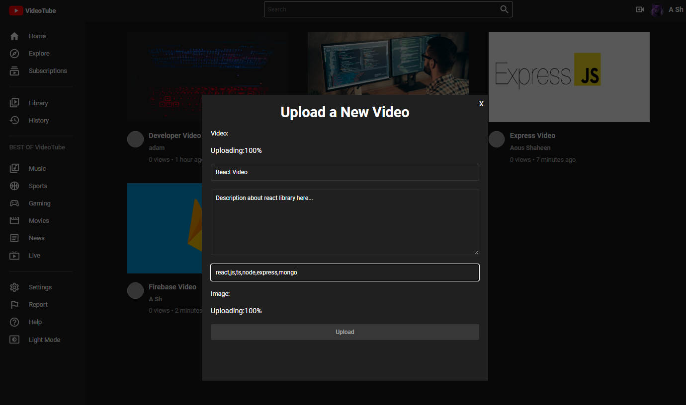

# MERN-Youtube-Clone

## Welcome! 👋

Thanks for checking out this Application.

## Overview
A complete Youtube-Clone Application with several key features:
- User registration and authentication
- Video upload
- Video playback
- Subscription system
- Video recommendations
- Trends page and more

### Links

- App URL: [Github](https://github.com/shaheen7a/MERN-Youtube-Clone.git)
- Not Deployed 🌐

## My process

### Built with

- React Js
- Node JS
- Express JS
- MongoDB
- Firebase
- MUI
- CSS
- JavaScript
- JSX

## Author

- Linkedin - [@aous-shaheen-381636221](https://www.linkedin.com/in/shaheen2001/)
- Facebook - [@aoushaheen7](https://www.facebook.com/shaheen72001/)

By me 🚀🚀🚀
Aous Shaheen
